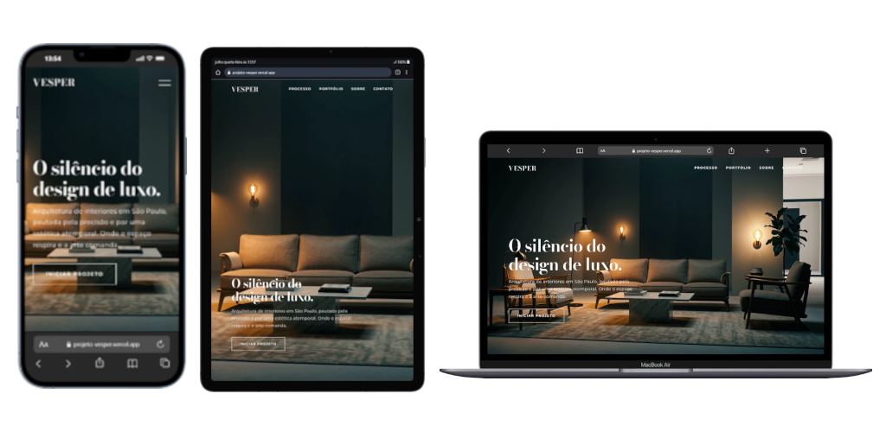

# Studio Vesper

Landing page institucional para um estúdio de arquitetura e interiores de alto padrão, com estética *Quiet Luxury*. Apresenta processo, portfólio, sobre e contato em uma única página responsiva — **desenvolvida com um fluxo de trabalho apoiado em IA**, do planejamento à implementação (veja [Processo de Desenvolvimento](#processo-de-desenvolvimento)).

[](https://projeto-vesper.vercel.app/)
*Clique na imagem para acessar o site publicado.*

## Sobre o Projeto

O Vesper é o site institucional do **Studio Vesper**, estúdio fictício de arquitetura de interiores sediado em São Paulo, criado por Alex Macol. A proposta visual é transmitir sofisticação através da simplicidade: paleta escura, tipografia serifada elegante (Bodoni Moda) combinada a uma sans-serif limpa (Montserrat), vídeos de fundo e uma navegação enxuta.

A página foi estruturada em seções de rolagem única (*single page*), guiando o visitante por uma narrativa: primeiro o impacto visual do hero em vídeo, depois o método de trabalho do estúdio, o portfólio de obras selecionadas, a apresentação do fundador, depoimentos de clientes e, por fim, um formulário de contato.

## Processo de Desenvolvimento

Este projeto foi construído com um fluxo de trabalho apoiado em Inteligência Artificial, combinando ferramentas externas de planejamento com agentes de IA integrados ao editor de código:

- **Google Stitch** foi utilizado na etapa de concepção para gerar os documentos `prd.md` (Product Requirements Document) e `design.md`, definindo respectivamente os requisitos funcionais do produto e as diretrizes visuais (paleta de cores, tipografia, estilo *Quiet Luxury*) antes do início da implementação.
- **Agentes de IA no editor de código** foram responsáveis por interpretar os comandos dados com base nesses documentos, implementando a estrutura HTML, os estilos e os scripts a partir das especificações definidas no PRD e no design doc.
- A condução do processo — definição de requisitos, revisão do design, ajustes finos e validação do resultado final — foi feita manualmente, com a IA atuando como ferramenta de aceleração dentro de um fluxo planejado.

Essa abordagem teve como objetivo explorar um workflow moderno de desenvolvimento, unindo planejamento assistido por IA fora do editor com execução assistida por IA dentro dele.

## Funcionalidades Principais

- **Hero em vídeo** com autoplay em loop, criando impacto visual imediato na abertura do site
- **Menu de navegação responsivo**, com versão desktop fixa e overlay de menu mobile
- **Seção "Método Vesper"** apresentando o processo de trabalho em 3 etapas (Imersão, Concepção, Materialização), incluindo vídeo ilustrativo
- **Galeria de portfólio** em grid assimétrico, exibindo projetos residenciais e corporativos com imagens em *lazy loading*
- **Seção sobre o fundador** com destaque para posicionamento (São Paulo, foco residencial *high-end*)
- **Depoimentos de clientes** em formato de citação (*blockquote*)
- **Formulário de contato** (nome, e-mail e interesse) e link direto para WhatsApp
- **Animações de entrada (*reveal*)** aplicadas aos elementos conforme o usuário rola a página
- **Rodapé** com links para redes sociais

## Tecnologias Utilizadas

- **HTML5** semântico, organizando o conteúdo em `<header>`, `<section>` e `<footer>`
- **CSS3** para estilização, layout em grid/flexbox e responsividade (arquivo `src/css/styles.css`)
- **JavaScript** puro (*vanilla JS*) para interatividade — menu mobile, animações de rolagem e comportamento do formulário (arquivo `src/js/script.js`)
- **Google Fonts** (Bodoni Moda e Montserrat) carregadas via `<link>` com pré-conexão para otimização de performance
- Estrutura de projeto organizada em `src/` com subpastas dedicadas a `css/`, `js/` e `assets/` (imagens e vídeos)

## Como Executar

Este é um projeto **front-end estático**, sem necessidade de servidor ou instalação de dependências.

1. Clone o repositório:
   ```bash
   git clone https://github.com/Alexmacol/projeto-vesper.git
   ```
2. Acesse a pasta do projeto:
   ```bash
   cd projeto-vesper
   ```
3. Abra o arquivo `index.html` diretamente no navegador, ou utilize uma extensão como **Live Server** (VS Code) para servir o projeto localmente com recarregamento automático.

Não há build, instalação de pacotes ou variáveis de ambiente necessárias para rodar o projeto.